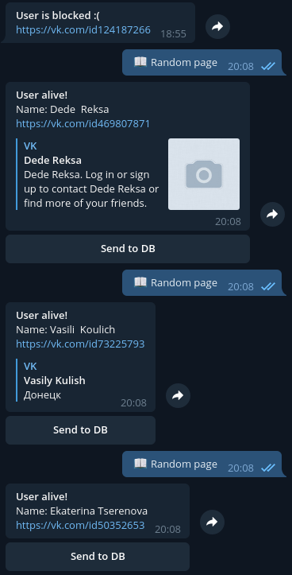

# VK random page to telegram bot
 Bot for Telegram, that returns random page from VK, based on PyTelegramBotApi


### Installation and run
Using console:
```
https://github.com/Antcating/vk-rand-page-telegram-bot.git
cd vk-rand-page-telegram-bot
python3 vk_rand.py
```



### Config

#### Initial Config
Before first run of the bot you will have to input Bot Token of your bot, that you can get from [@BotFather](t.me/BotFather) in `vk_rand.py` file. The token will be saved and after that you won't be asked to input it again. Initial configuration is over. 
Additional information about Bot API and etc. can be found on the main page of the [PyTelegramBotAPI](https://github.com/eternnoir/pyTelegramBotAPI). 

### Usage

*/start* - start the program.\
After applying  */start* bot will show the keyboard with *Random Page*  button. You should simply press on this button and bot return random page.

All configs are saving, so after reboot the settings will not be reset.

